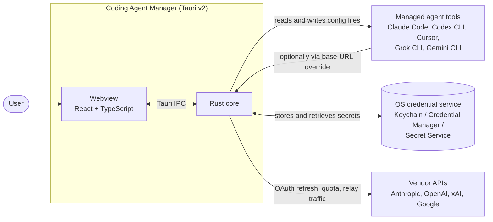
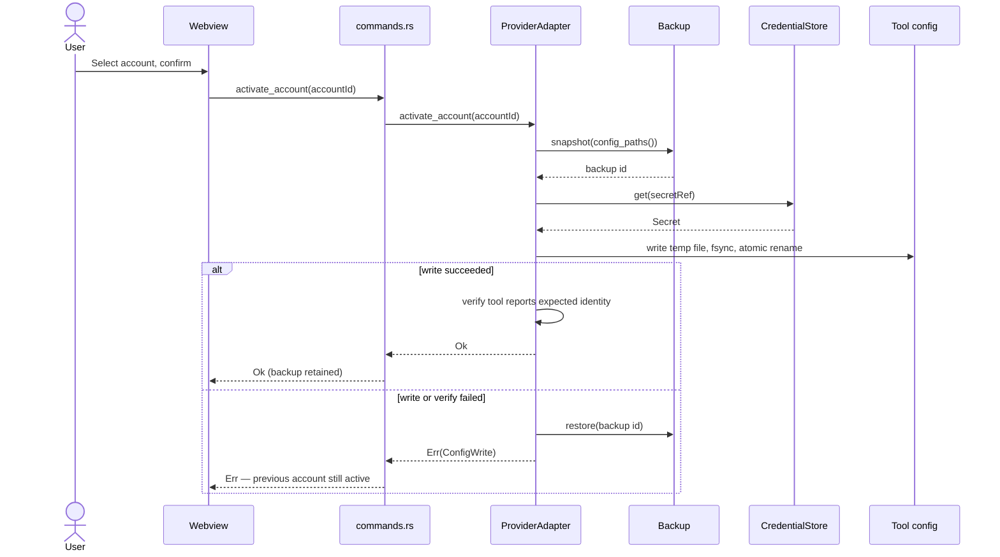

# Architecture

## 1. System context



The application is the only component that writes to a managed tool's config.
Tools are never modified while they are running if the adapter can detect that;
see §7.

## 2. Process and thread model

| Component         | Runs as                                   | Responsibility                                           |
| ----------------- | ----------------------------------------- | -------------------------------------------------------- |
| Tauri main        | Native process                            | Window lifecycle, IPC dispatch, plugin host.             |
| Rust core         | Same process, async tasks                 | Adapters, storage, relay, router.                        |
| Webview           | Platform WebView2 / WKWebView / WebKitGTK | Presentation only. Holds no secret and no business rule. |
| Relay listener    | Async task, own port                      | HTTP ingress; started and stopped by the user.           |
| Refresh scheduler | Async task                                | Refreshes tokens before expiry; backs off on failure.    |

The webview never receives a secret. It receives masked identities and opaque
account ids, which is what makes `NFR-1` enforceable rather than aspirational.

## 3. Layering

```text
src-tauri/src/
  commands.rs   IPC surface           may depend on: everything below
  providers/    per-tool adapters     may depend on: storage, model, error
  storage/      secret persistence    may depend on: model, error
  relay/        protocol adaptation   may depend on: router, providers, model, error
  router/       rule evaluation       may depend on: model, error
  model.rs      domain types          depends on: nothing
  error.rs      error taxonomy        depends on: nothing
```

Two rules make this enforceable in review:

1. **Only `commands.rs` may reference `tauri::`.** Everything below it compiles
   and tests without a webview, and stays reusable from the future headless
   binary that the Docker image needs (`FR-10`).
2. **No adapter may reference another adapter.** Cross-provider behaviour lives
   in core, never in a vendor-specific module.

## 4. The adapter contract

Every managed tool implements `ProviderAdapter`
(`src-tauri/src/providers/mod.rs`):

| Method               | Contract                                                                                                           |
| -------------------- | ------------------------------------------------------------------------------------------------------------------ |
| `id()`               | Stable, kebab-case, never renamed — it appears in stored state.                                                    |
| `descriptor()`       | Static facts plus live detection. Must not lie about maturity (`NFR-8`).                                           |
| `config_paths()`     | Every path the adapter may read or write, existing or not. The backup subsystem and diagnostics both consume this. |
| `detect()`           | Cheap and side-effect free.                                                                                        |
| `list_accounts()`    | Read-only. Returns masked identities only.                                                                         |
| `activate_account()` | The only mutating method. Must back up first (`NFR-4`) and must be atomic from the tool's perspective.             |
| `quota()`            | Returns an empty vector when the provider publishes no signal. Never fabricates a number.                          |

### Adding a sixth provider

1. Write `docs/research/<provider>.md` first, with confidence markers. An
   adapter written before the research is an adapter that will corrupt
   someone's login.
2. Add `src-tauri/src/providers/<provider>.rs` implementing the trait, with
   every path claim carrying its marker in a doc comment.
3. Add one line to `providers::registry()`.
4. Add contract-test fixtures under `src-tauri/tests/fixtures/<provider>/`
   (see [`TESTING.md`](TESTING.md)).
5. Add a row to [`PROVIDER_MATRIX.md`](PROVIDER_MATRIX.md) and to the README
   table.

No core file changes. If a provider cannot be supported without changing core,
that is a signal the trait is wrong — widen the trait deliberately rather than
special-casing.

## 5. Switching an account



The backup is taken before the secret is even retrieved, so a failure in secret
retrieval cannot leave a half-written config.

## 6. Relay and router

### Ingress and format detection

The relay exposes one port with several path prefixes, one per inbound dialect,
rather than sniffing bodies:

| Path prefix                             | Inbound format     |
| --------------------------------------- | ------------------ |
| `/v1/chat/completions`, `/v1/responses` | OpenAI             |
| `/v1/messages`                          | Anthropic Messages |
| `/v1beta/models/*:generateContent`      | Gemini             |

Explicit paths mean a malformed body produces a clear 400 rather than being
silently misinterpreted as another vendor's schema.

### Translation

Translation is a pure function of `(from, to, body)` with no I/O, which makes it
golden-file testable (see [`TESTING.md`](TESTING.md)). Three concerns dominate:

- **Message shape.** System prompt placement, role naming, and content-part
  arrays differ between all three dialects.
- **Streaming.** All three stream, with different event framing. The relay
  translates event by event and must never buffer a whole response to translate
  it, or the user loses the reason to stream.
- **Capability mismatch.** A field with no counterpart (a reasoning budget, an
  image size) is either mapped to the closest supported value or rejected with a
  clear error. It is never dropped silently.

### Routing

Rules are evaluated in order; the first rule whose model pattern matches and
whose `max_utilization` gate is satisfied wins. On a `429` or an equivalent
rate-limit signal, the router marks the account throttled until its known reset
time and retries with the next matching rule. If no rule matches, the request
fails with an explicit error rather than falling back to an arbitrary account —
silently spending the wrong account's quota is worse than an error.

## 7. State, persistence, and migration

| Data                            | Location                                 | Class                              |
| ------------------------------- | ---------------------------------------- | ---------------------------------- |
| Secrets                         | OS credential service, or encrypted file | Secret. Never exported.            |
| Accounts, profiles, route rules | Application data directory, JSON         | Durable, non-secret. Versioned.    |
| Quota snapshots                 | Application cache directory              | Disposable. Safe to delete.        |
| Backups of tool configs         | Application data directory, timestamped  | Durable until pruned by retention. |

Durable state carries a `schemaVersion`. On start, a newer-than-known version
causes a refusal to write, not a best-effort parse: an older build must never
silently downgrade a newer file. Migrations are forward-only and are applied to
a copy, with the original retained until the migration is confirmed.

## 8. Concurrency and failure

| Situation                                   | Behaviour                                                                                                                                                         |
| ------------------------------------------- | ----------------------------------------------------------------------------------------------------------------------------------------------------------------- |
| Two refreshes race for one account          | A per-account async lock serialises them; the loser observes the winner's result.                                                                                 |
| The managed tool is running during a switch | Where the adapter can detect a running process or an advisory lock (Grok CLI takes one), it refuses and explains. Where it cannot, the docs state the limitation. |
| Provider API unreachable                    | Cached quota is shown with its `capturedAt` age. Switching still works; it is a local operation (`NFR-3`).                                                        |
| Managed config unparsable                   | The adapter refuses to write and offers a restore. It never rewrites a file whose schema it does not fully understand.                                            |
| Credential store unavailable                | The application refuses to store secrets and says why. It never falls back to plaintext.                                                                          |

## 9. Front-end structure

| Path                 | Role                                                                                                          |
| -------------------- | ------------------------------------------------------------------------------------------------------------- |
| `src/pages/`         | One component per route; no direct `invoke` calls except through `src/lib/tauri.ts`.                          |
| `src/lib/tauri.ts`   | The single typed boundary to Rust. Command names exist in exactly one place.                                  |
| `src/types/index.ts` | Mirrors `src-tauri/src/model.rs`. Changed together, always.                                                   |
| `src/components/`    | Presentational components. `NotImplemented` carries the `FR-*` id so unfinished surface area stays auditable. |
