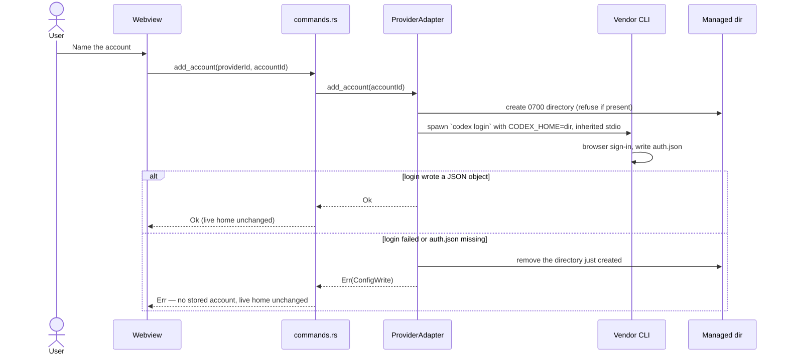
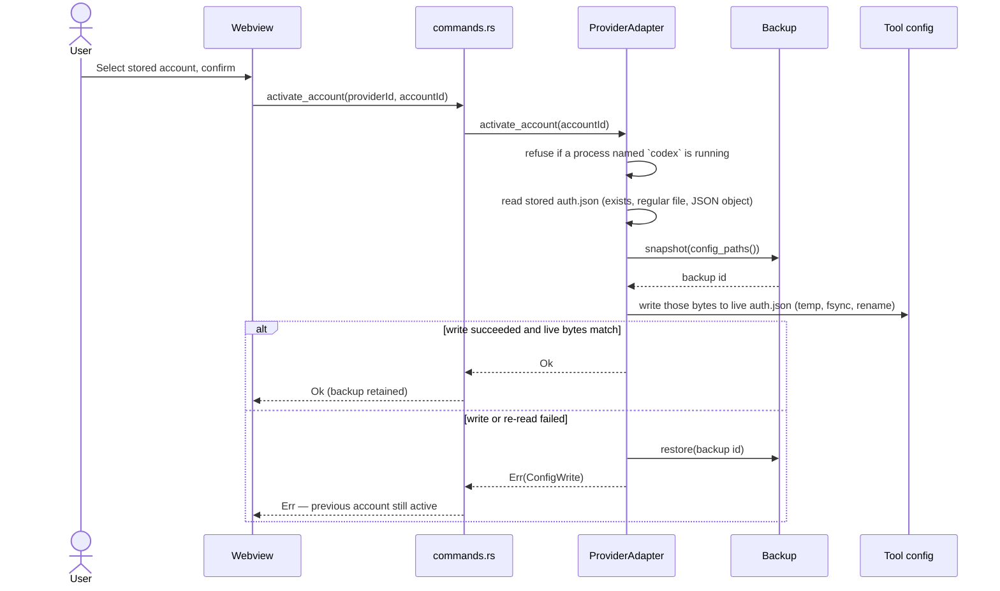

# Architecture

## 1. System context


The application is the only component that writes to a managed tool's config.
Tools are never modified while they are running if the adapter can detect that;
see §7.

## 2. Process and thread model

| Component         | Runs as                                   | Responsibility                                           |
| ----------------- | ----------------------------------------- | -------------------------------------------------------- |
| Tauri main        | Native process                            | Window lifecycle, IPC dispatch, plugin host.             |
| Rust core         | Same process, async tasks                 | Adapters, storage, relay, router.                        |
| Webview           | Platform WebView2 / WKWebView / WebKitGTK | Presentation only. Holds no secret and no business rule. |
| Relay listener    | Async task, own port                      | HTTP ingress; started and stopped by the user.           |
| Refresh scheduler | Async task                                | Refreshes tokens before expiry; backs off on failure.    |

The webview never receives a secret. It receives masked identities and opaque
account ids, which is what makes `NFR-1` enforceable rather than aspirational.

## 3. Layering

```text
src-tauri/src/
  commands.rs   IPC surface           may depend on: everything below
  providers/    per-tool adapters     may depend on: storage, model, error
  storage/      secret persistence    may depend on: model, error
  relay/        protocol adaptation   may depend on: router, providers, model, error
  router/       rule evaluation       may depend on: model, error
  model.rs      domain types          depends on: nothing
  error.rs      error taxonomy        depends on: nothing
```

Two rules make this enforceable in review:

1. **Only `commands.rs` may reference `tauri::`.** Everything below it compiles
   and tests without a webview, and stays reusable from the future headless
   binary that the Docker image needs (`FR-10`).
2. **No adapter may reference another adapter.** Cross-provider behaviour lives
   in core, never in a vendor-specific module.

## 4. The adapter contract

Every managed tool implements `ProviderAdapter`
(`src-tauri/src/providers/mod.rs`):

| Method               | Contract                                                                                                                                                 |
| -------------------- | -------------------------------------------------------------------------------------------------------------------------------------------------------- |
| `id()`               | Stable, kebab-case, never renamed — it appears in stored state.                                                                                          |
| `descriptor()`       | Static facts plus live detection. Must not lie about maturity or `capabilities` (`NFR-8`).                                                               |
| `config_paths()`     | Every path the adapter may read or write, existing or not. The backup subsystem and diagnostics both consume this.                                       |
| `detect()`           | Cheap and side-effect free.                                                                                                                              |
| `list_accounts()`    | Read-only. Returns masked identities only.                                                                                                               |
| `add_account()`      | Create a stored account. Must not touch the live tool home. Default: `NotImplemented`.                                                                   |
| `activate_account()` | Make a stored account the one the tool will use. Must back up first (`NFR-4`) and must be atomic from the tool's perspective. Default: `NotImplemented`. |
| `delete_account()`   | Forget a stored account. Must not touch the live tool home, so deleting the active copy does not sign the tool out. Default: `NotImplemented`.           |
| `quota()`            | Returns an empty vector when the provider publishes no signal. Never fabricates a number.                                                                |

`ProviderDescriptor.capabilities` is the list of mutating operations the
adapter will honour: `add-account`, `switch-account`, `delete-account`. The
Accounts page offers a button only when that list contains the matching
value. Maturity cannot serve this purpose. It is one label per adapter, and
an experimental adapter may still add, switch, and delete — Codex CLI does —
while another experimental adapter implements none of those. Gating on
maturity would either hide working actions or offer actions that return
`NotImplemented` (`NFR-8`).

`add_account` and `delete_account` are mutating, but they must not write
the live tool home. `activate_account` is the method that may replace a
file the user's tool owns, and it is the one that must snapshot first.

### Adding a sixth provider

1. Write `docs/research/<provider>.md` first, with confidence markers. An
   adapter written before the research is an adapter that will corrupt
   someone's login.
2. Add `src-tauri/src/providers/<provider>.rs` implementing the trait, with
   every path claim carrying its marker in a doc comment.
3. Add one line to `providers::registry()`.
4. Add contract-test fixtures under `src-tauri/tests/fixtures/<provider>/`
   (see [`TESTING.md`](TESTING.md)).
5. Advertise a capability only when the matching method is implemented.
6. Add a row to [`PROVIDER_MATRIX.md`](PROVIDER_MATRIX.md) and to the README
   table.

No core file changes. If a provider cannot be supported without changing core,
that is a signal the trait is wrong — widen the trait deliberately rather than
special-casing.

## 5. Account operations

Codex CLI is the only adapter that implements add, switch, and delete.
Claude Code, Grok CLI, Gemini CLI, and Cursor return `NotImplemented` from
those methods and advertise no capabilities.

### Managed-account layout

Stored copies live under the application data directory, not under the
tool home and not under the system temporary tree (Codex 0.144.4 refuses
to create helper binaries there):

```text
{data_dir}/accounts/{provider_id}/{account_id}/
```

For Codex CLI the file inside that directory is `auth.json`, written by
the vendor CLI. `{data_dir}` comes from `paths::project_dirs()`. Tests
inject a `TempDir` so a fixture never writes into a real data directory.
The live Codex home (`$CODEX_HOME` if set, otherwise `~/.codex`) is a
different tree. See
[ADR 0008](adr/0008-vendor-written-auth-json-for-stored-codex-accounts.md).

### Adding a stored account



Stdio is inherited, so the CLI's prompts appear on the terminal that
launched this application. The child's output is never captured. The
command does not return until sign-in finishes or fails. Adding a stored
account does not switch the live home to it.

### Switching an account

Only Codex CLI implements this, and only for a stored copy. The document
being written is the vendor-issued `auth.json` from the managed directory.
This application does not retrieve a secret from the credential store and
does not compose credential JSON.



The backup is taken after the stored file has been loaded and before the
live home is touched, so a missing account cannot produce a snapshot, and
a write failure can still restore. Verification is a re-read of the live
file: the bytes must match what was written and must form a JSON object.
That check does not prove `codex login status` would report the expected
identity, and it does not prove the vendor accepts the copied credential
(`docs/research/codex-cli.md` §5).

`list_accounts` for Codex merges the live identity with every stored
copy whose `auth.json` is a JSON object. A stored account is marked
active only when its file is byte-identical to the live one. If one
matches, the live row is omitted rather than listed twice. If none
match, the live row is listed as active and not stored.

`config.toml` and every other live-home file are left untouched. They
belong to the machine, not the account.

## 6. Relay and router

### Ingress and format detection

The relay exposes one port with several path prefixes, one per inbound dialect,
rather than sniffing bodies:

| Path prefix                             | Inbound format     |
| --------------------------------------- | ------------------ |
| `/v1/chat/completions`, `/v1/responses` | OpenAI             |
| `/v1/messages`                          | Anthropic Messages |
| `/v1beta/models/*:generateContent`      | Gemini             |

Explicit paths mean a malformed body produces a clear 400 rather than being
silently misinterpreted as another vendor's schema.

### Translation

Translation is a pure function of `(from, to, body)` with no I/O, which makes it
golden-file testable (see [`TESTING.md`](TESTING.md)). Three concerns dominate:

- **Message shape.** System prompt placement, role naming, and content-part
  arrays differ between all three dialects.
- **Streaming.** All three stream, with different event framing. The relay
  translates event by event and must never buffer a whole response to translate
  it, or the user loses the reason to stream.
- **Capability mismatch.** A field with no counterpart (a reasoning budget, an
  image size) is either mapped to the closest supported value or rejected with a
  clear error. It is never dropped silently.

### Routing

Rules are evaluated in order; the first rule whose model pattern matches and
whose `max_utilization` gate is satisfied wins. On a `429` or an equivalent
rate-limit signal, the router marks the account throttled until its known reset
time and retries with the next matching rule. If no rule matches, the request
fails with an explicit error rather than falling back to an arbitrary account —
silently spending the wrong account's quota is worse than an error.

## 7. State, persistence, and migration

| Data                            | Location                                 | Class                                                                                                                               |
| ------------------------------- | ---------------------------------------- | ----------------------------------------------------------------------------------------------------------------------------------- |
| Secrets this application stores | OS credential service, or encrypted file | Secret. Never exported.                                                                                                             |
| Stored Codex `auth.json` copies | `{data_dir}/accounts/codex-cli/{id}/`    | Secret on disk. Vendor-written. Not encrypted here. See [ADR 0008](adr/0008-vendor-written-auth-json-for-stored-codex-accounts.md). |
| Accounts, profiles, route rules | Application data directory, JSON         | Durable, non-secret. Versioned.                                                                                                     |
| Quota snapshots                 | Application cache directory              | Disposable. Safe to delete.                                                                                                         |
| Backups of tool configs         | Application data directory, timestamped  | Durable until pruned by retention. Contain the live `auth.json` after a Codex switch.                                               |

Durable state carries a `schemaVersion`. On start, a newer-than-known version
causes a refusal to write, not a best-effort parse: an older build must never
silently downgrade a newer file. Migrations are forward-only and are applied to
a copy, with the original retained until the migration is confirmed.

## 8. Concurrency and failure

| Situation                                   | Behaviour                                                                                                                                                                                                                                                                                             |
| ------------------------------------------- | ----------------------------------------------------------------------------------------------------------------------------------------------------------------------------------------------------------------------------------------------------------------------------------------------------- |
| Two refreshes race for one account          | A per-account async lock serialises them; the loser observes the winner's result.                                                                                                                                                                                                                     |
| The managed tool is running during a switch | Codex CLI refuses if a process named `codex` is running, or if the process table cannot be read. Detecting by process name is approximate. Grok CLI takes an advisory lock, but that adapter does not switch yet. Where an adapter cannot tell, it must refuse or the docs must state the limitation. |
| Provider API unreachable                    | Cached quota is shown with its `capturedAt` age. A Codex switch is a local file write and does not need the network (`NFR-3`).                                                                                                                                                                        |
| Managed config unparsable                   | The adapter refuses to write and offers a restore. It never rewrites a file whose schema it does not fully understand.                                                                                                                                                                                |
| Credential store unavailable                | The application refuses to store secrets and says why. It never falls back to plaintext.                                                                                                                                                                                                              |

## 9. Front-end structure

| Path                 | Role                                                                                                          |
| -------------------- | ------------------------------------------------------------------------------------------------------------- |
| `src/pages/`         | One component per route; no direct `invoke` calls except through `src/lib/tauri.ts`.                          |
| `src/lib/tauri.ts`   | The single typed boundary to Rust. Command names exist in exactly one place.                                  |
| `src/types/index.ts` | Mirrors `src-tauri/src/model.rs`. Changed together, always.                                                   |
| `src/components/`    | Presentational components. `NotImplemented` carries the `FR-*` id so unfinished surface area stays auditable. |
